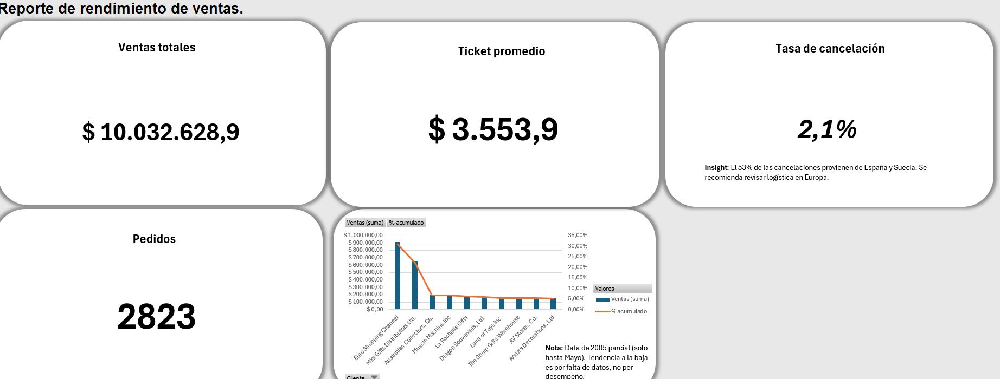

# 📊 Portafolio: Análisis de Rendimiento de Ventas Retail

## 📝 Descripción del Proyecto
Este proyecto es una simulación de negocio (Caso de Estudio) donde actúo como Data Analyst para una empresa de retail. El objetivo fue transformar datos crudos de ventas en insights estratégicos para la gerencia.

## 🛠️ Herramientas Utilizadas
* **Microsoft Excel:** Limpieza de datos (ETL) con Power Query, Tablas Dinámicas y Dashboards interactivos.
* **SQL:** Script de validación de KPIs y consultas de integridad de datos.
* **Análisis de Negocio:** Aplicación de la Ley de Pareto (80/20) y detección de fugas operativas.

## 📷 Vista Previa del Dashboard

## 🔍 Hallazgos Clave (Insights)
1.  **Concentración de Riesgo:** Se detectó que **España y Suecia** concentran el 53% de las cancelaciones, sugiriendo problemas logísticos regionales.
2.  **Clientes VIP:** Mediante un análisis de Pareto, se identificó que el **Top 10 de clientes** genera el 30% de los ingresos totales.
3.  **Integridad de Datos:** Se reportó que la data del año 2005 está incompleta (corte en Mayo), ajustando las proyecciones anuales.

## 📂 Contenido del Repositorio
* `Sales_Performance_Dashboard_project_JohnnyMorales.xlsx`: El archivo Excel con el dashboard interactivo.
* `consultas_validacion_kpis.sql`: Código SQL utilizado para validar la lógica de negocio.

---
*Proyecto realizado por Johnny Morales - 2026*
